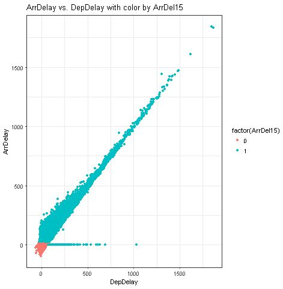

# Flight Arrival Delay Prediction

### Info
- **Module:** Data Science Essentials
- **Tools Used:**
  - Microsoft Azure Machine Learning Studio
    - R code (via Execute R Script module)
  - Microsoft Excel
- **Assets:**
  - [_ScatterPlot_](./source/ScatterPlot.R) (R code used for Scatter Plots)
  - [_images_](./images) folder (Misc. image files)

---
### Description  
----
In this project, analysis is performed on the ***Flights Delay Data*** dataset to identify features that might be predictive of how many minutes late or early a flight will be.

After which a Regression model is trained, tested, and published (as a web service) which can be used to predict flight arrival delays.

---
### Background
---
***Flights Delay Data*** dataset is a built-in dataset in Azure ML platform that contains flight-related information for USA airports in the year 2013. This include info such as the time (year, month, day of month), carrier, origin and destination airports of the flights, as well as whether they were on-time, early or late. 

Flight arrival delay prediction is useful for airports, airlines, and passengers as it allows them to plan and prepare for potential delays and to make informed decisions about travel plans.

When the predicting machine learning model is built, it can be used to predict the arrival delay of flights. 

---
### Sample Work
---
**Project Workflow** 
| Part    | Workflow Process/(s) | 
| :---:   |  :----               |        
| 1.      | **Data Cleansing:** - Join the ***Airport Codes Dataset*** to get the Origin and Destination Airports City, State, and Name - Remove duplicates and replace missing values   |
| 2.      | **Data Exploration:** -  Analyse the **ArrDelay** column (Arrival Delay in minutes) - Use Histograms to compare numeric columns - Use Scatter Plots to compare numeric columns    Examples of Scatter Plots conditioned on ***ArrDel15*** column (binary column indicating whether a flight arrived 15 or more minutes late)([_R Code_](./source/ScatterPlot.R) used):   There is a near-linear relationship between ***DepDelay*** and ***ArrDelay*** for late flights. As departure delay increases, so does arrival delay.   There is an apparent relationship between ***ArrDelay*** and ***CRSDepTime***. Flights that depart early in the morning are typically less delayed than flights that are scheduled to depart after around 5am (0500hrs), at which time delays tend to get significantly longer. Delays then gradually get shorter as the day progresses. |
| 3.      | **Machine Learning:** - Train a Regression model - Test and Evaluate the model - Publish and Use the model    **Model Evaluation:**   The metrics shown are for the **training data (left)** and the **testing data (right)**. In both cases, their performance are very close to each other, with a **Root Mean Squared Error (RMSE)** of close to 13 minutes. Training and testing accuracy are also very close to each other, both being 89% as given by the **Coefficient of Determination** values (which is also the Adjusted R-Squared value).   From the bias and variance trade-off diagram, this means that the **accuracy of the model** is **high for the training data (low bias)** and is also **high for the testing data (low variance)**. This corresponds to the best fit model (lower left above) which means the predicting model created is fairly accurate.  **Predictive Experiment:**    Finally, a predictive experiment is created to publish the model as a web service. End-users with the **Request/Response link** and the **API key** of the web service will then be able to use the predictive model to predict the flight arrival delay.   |

---
### Conclusion
---
A predicting machine learning model is created using Microsoft Azure Machine Learning platform (and R) which can be used to predict the arrival delay of flights.